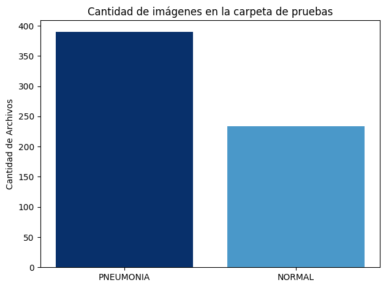
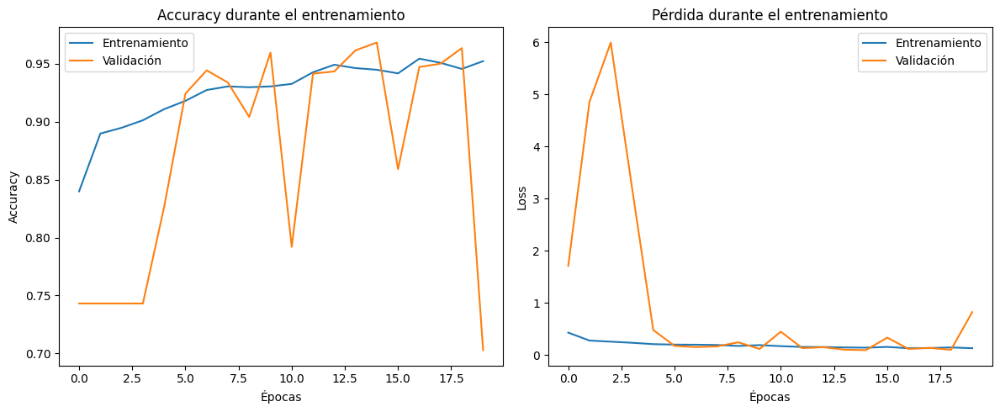
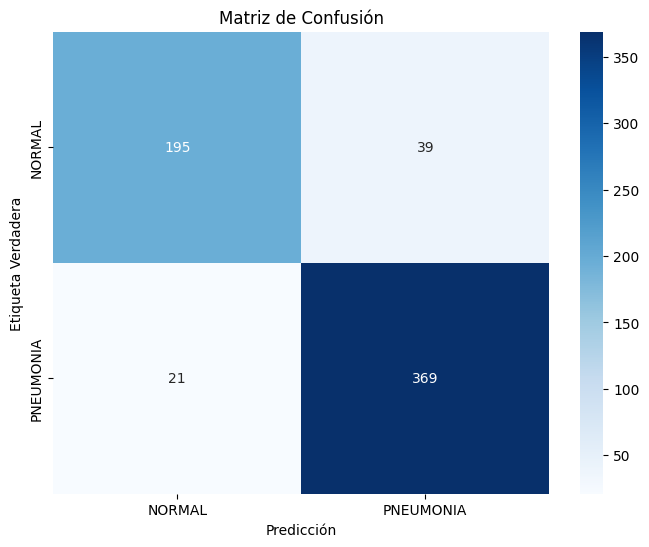

# Memoria técnica

## Portada
- **Nombre del Proyecto**: Clasificación de imágenes de Rayos X 
- **Fecha**: 29 de noviembre de 2024.
- **Integrantes**:  
  - Diego Arias Cabrera
  - Rodrigo Armendáriz Viegas
### Glosario
- **Neumonía:** 
    - **Definición:** Una infección en uno o ambos pulmones que causa que los alvéolos pulmonares se llenen de líquido o pus. 
    - **Importancia:** Esta enfermedad es muy común en todas las poblaciones y puede llegar a provocar síntomas graves

- **Lóbulos pulmonares:** 
    - **Definición** Secciones en las que están divididos los pulmones.
    - **Relevancia:** La neumonía bacteriana usualmente se concentra en un lóbulo del pulmón.

- **Rayos X:**
    - **Definición:** Un tipo de radiación por ondas electromagnéticas. 
    - **Relevancia:** Distintos tejidos absorben diferentes cantidades de radiación, por lo que las imágenes de rayos X sirven para detectar la presencia de cuerpos extraños en el cuerpo, incluyendo las bacterias y los virus que causan la neumonía.

## Índice
- [Portada](#portada)
- [Alcance del proyecto](#alcance-del-proyecto)
  - [Objetivo](#objetivo)
  - [Introducción](#introducción)
- [Fuentes de información y procedimientos aplicados](#fuentes-de-información-y-procedimientos-aplicados)
  - [Construcción del modelo](#construcción-del-modelo)
  - [Resultados modelo](#resultados-modelo)
  - [Pruebas sobre el modelo](#pruebas-sobre-el-modelo)
  - [Conclusiones](#conclusiones)
- [Conclusiones generales](#conclusiones-generales)
- [Anexos](#anexos)

## Alcance del proyecto

### Objetivo
El objetivo de este proyecto es clasificar imágenes de rayos X del tórax en una de dos categorías:
1. **Con neumonía (Etiqueta "PNEUMONIA")**
2. **Sin neumonía (Etiqueta "NORMAL")**

Esta clasificación se hace según los criterios que se mencionarán en la introducción.

### Introducción

La neumonía es una enfermedad grave y compleja, tanto en sus causas como en sus síntomas. Esta enfermedad conlleva una infección en uno o ambos pulmones, lo cual provoca que los alveolos pulmonares se llenen de líquido o pus, llevando a síntomas que van desde aquellos similares a los de una gripa hasta otros más serios como abscesos pulmonares o insuficiencia renal o respiratoria. La neumonía es más comúnmente causada por bacterias (aquellas con *pneumoniae* en el nombre), pero también puede ser de origen viral o fúngico (causada por hongos).

Una de sus formas de diagnóstico es a partir de la observación de radiografías de tórax, que es donde entra el objetivo de este proyecto. Los avances en inteligencia artificial permiten ahora la introducción de modelos que clasifican este tipo de imágenes para poder asistir en un diagnóstico, lo cual es especialmente útil en áreas con acceso limitado a radiólogos experimentados. En este caso usamos una red neuronal convolucional (CNN por sus siglas en inglés) para construir un modelo que realize esta clasificación.

En la imagen de la izquierda tenemos la radiografía de un pulmón sano, la cual no presenta opacificación anormal en la imagen. La imagen de en medio es del tórax de alguien con neumonía bacteriana, la cual usualmente se ve consolidada en algún lóbulo pulmonar, en este caso en el lóbulo superior derecho (señalado por las flechas blancas). Por último, la neumonía viral (imagen de la derecha) resulta en opacidad intersticial en ambos pulmones.

## Fuentes de información y procedimientos aplicados

Descargamos el conjunto de datos del enlace de Kaggle incluido, el cual es de imágenes de rayos X del tórax de diferentes personas, algunas diagnosticadas con neumonía según dos expertos y otras sanas. Los datos están divididos primero en tres carpetas: test(imágenes de prueba), train (imágenes de entrenamiento del modelo) y val (imágenes de validación). Cada una de estas, a su vez, se divide en una carpeta "NORMAL" (imágenes de pacientes sanos) y otra "PNEUMONIA" (imágenes de pacientes con neumonía), conteniendo un total de 5856 imágenes en formato .jpeg.

### División de los datos
La siguiente gráfica muestra la distribución de las imágenes en el conjunto de datos de entrenamiento:

Y la siguiente es sobre el conjunto de datos de prueba:

Notamos que el conjunto de entrenamiento es mucho mayor que el de pruebas, y ambos tienen una mayor presencia de imágenes de neumonía.
En total hay 5216 imágenes en el conjunto de entrenamiento, 1341 sanas y 3875 con neumonía, y en el de prueba hay 624 de las cuales 234 son imágenes de personas sanas y 390 de personas con neumonía.

## Construcción del modelo

### **Arquitectura**

| **Layer (type)**              | **Output Shape**          | **Param #**  |
|-------------------------------|---------------------------|--------------|
| `input_1 (InputLayer)`         | (None, 256, 256, 1)       | 0            |
| `conv2d (Conv2D)`              | (None, 254, 254, 32)      | 320          |
| `batch_normalization (BatchNormalization)` | (None, 254, 254, 32)      | 128          |
| `max_pooling2d (MaxPooling2D)` | (None, 127, 127, 32)      | 0            |
| `conv2d_1 (Conv2D)`            | (None, 125, 125, 64)      | 18,496       |
| `batch_normalization_1 (BatchNormalization)` | (None, 125, 125, 64)      | 256          |
| `max_pooling2d_1 (MaxPooling2D)` | (None, 62, 62, 64)       | 0            |
| `conv2d_2 (Conv2D)`            | (None, 60, 60, 128)       | 73,856       |
| `batch_normalization_2 (BatchNormalization)` | (None, 60, 60, 128)       | 512          |
| `max_pooling2d_2 (MaxPooling2D)` | (None, 30, 30, 128)      | 0            |
| `conv2d_3 (Conv2D)`            | (None, 28, 28, 256)       | 295,168      |
| `batch_normalization_3 (BatchNormalization)` | (None, 28, 28, 256)       | 1,024        |
| `max_pooling2d_3 (MaxPooling2D)` | (None, 14, 14, 256)      | 0            |
| `flatten (Flatten)`            | (None, 50176)             | 0            |
| `dense (Dense)`                | (None, 128)               | 6,421,696    |
| `dropout (Dropout)`            | (None, 128)               | 0            |
| `dense_1 (Dense)`              | (None, 64)                | 8,256        |
| `dropout_1 (Dropout)`          | (None, 64)                | 0            |
| `dense_2 (Dense)`              | (None, 32)                | 2,080        |
| `dense_3 (Dense)`              | (None, 1)                 | 33           |

### **Totales**
- **Total params:** 6,821,825
- **Trainable params:** 6,820,545
- **Non-trainable params:** 1,280

---

### **Funcionamiento del Modelo**
1. **Extracción de características**: Las imágenes son procesadas mediante cuatro capas convolucionales con normalización por lotes y reducción dimensional por *MaxPooling*.
2. **Aplanamiento**: La salida se convierte en un vector mediante la capa *Flatten*.
3. **Clasificación**: Las capas densas realizan la clasificación, con *Dropout* para prevenir el sobreajuste.
4. **Salida**: La capa final usa una función de activación sigmoide para la predicción binaria de neumonía.

Se usa esta red pues, siguiendo el objetivo del proyecto, extrae información relevante a través de las capas convolucionales, reduce sobreajuste y dimensionalidad para una mayor precisión y al final, según la probabilidad dada por la función de activación, nos da una probabilidad a partir de la cual clasifica a la imagen, que es justamente a lo que queremos llegar.

## Resultados del modelo

El modelo rinde de manera similar con los datos de entrenamiento y con los de validación, por lo que parece no haber sobreajuste.

### Precisión (Accuracy) según el conjunto de datos:
+ **Entrenamiento:** La precisión sobrepasa el 0.9 rápidamente y, si bien no se acerca tanto a 1.0 como nos gustaría, aumenta constantemente y se mantiene alrededor de 0.95
+ **Validación:** En las primeras épocas hay una precisión bastante baja, pero después esta precisión sobrepasa a veces la del conjunto de entrenamiento, lo cual es una buena señal, aunque oscila en algunas épocas, posiblemente por algunos datos atípicos.

### Pérdida (Loss) según el conjunto de datos:
+ **Entrenamiento:** La pérdida se mantiene baja y constantemente decrece, lo cual muestra un buen aprendizaje por parte del modelo.
+ **Validación:** Como se vio con la precisión, hay mucha pérdida en las primeras épocas, pero esta se estabiliza rápidamente y baja junto con la de entrenamiento.

## Pruebas sobre el modelo

Para evaluar el modelo, podemos ver su precisión y su sensibilidad a partir de la siguiente matriz de confusión

### Precisión
Obtuvimos una precisión del 90.4%, indicando que ese porcentaje de las imágenes clasificadas con la etiqueta de "PNEUMONIA" sí la presentaban realmente. Esto nos dice que hay una cantidad considerable aún de falsos positivos, por lo que podría mejorar el modelo.

### Sensibilidad
El 94.6% de los casos de neumonía se identificaron correctamente, lo cual, si bien podría mejorar, sobre todo considerando lo importante que es la sensibilidad por el contexto médico del proyecto, es igual una métrica bastante buena.

## Conclusiones
+ El modelo presentó un buen desempeño con ambos conjuntos de datos y no es tan sensible, por lo que, si bien siempre podría mejorar, el rendimiento del modelo para nuevos datos no debería verse afectado en mayor medida.
+ El contexto de diagnósticos médicos requiere de una mayor precisión y, sobre todo, sensibilidad, que las que nos da este modelo, pero igual presenta métricas buenas que logramos mejorar después de varios ajustes.

## Conclusiones generales

Nuestro clasificador de imágenes de rayos X para la detección de neumonía puede ser útil en áreas donde falten expertos o ayudar también a un diagnóstico temprano de esta enfermedad y como una segunda opinión.

La velocidad del modelo es una cualidad, siendo capaz de clasificar miles de imágenes del estilo en cuestión de minutos y, si bien podría ser más preciso, su utilidad en poblaciones de bajos recursos es grande.

## Anexos
+ [Repositorio de Github](https://github.com/RodrigoArmendarizV/2025-I-proyecto-I-DAC-RAV)
+ [Imágenes de rayos X del torso para la detección de neumonía en Kaggle](https://www.kaggle.com/datasets/paultimothymooney/chest-xray-pneumonia?resource=download)
+ [Información acerca de la neumonía en MedlinePlus](https://medlineplus.gov/spanish/pneumonia.html#:~:text=La%20neumonía%20es%20una%20infección,su%20estado%20general%20de%20salud.)